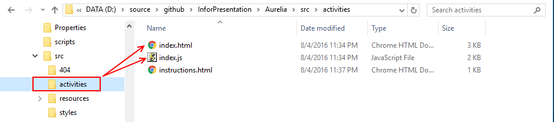

#Aurelia

##Quick History

Durandal was the precursor to the Aurelia framework. It was a core set of files that set up rules and behaviors as well as stitching together other, existing, libraries to form a cohesive, all encompassing framework for building SPAs. Rob Eisenberg, it's author, was already familiar with with building libraries as he had previously put together an **MVVM** framework for Microsoft's Silverlight application (originally called Caliburn, later version named Caliburn.Micro). Rob has also done a fair share of .Net development and made Durandal easy to integrate with Visual Studio (before any of the other frameworks of this type were trying this approach). As Durandal continued to mature Rob and his team kept writing more and more of the functionality in house (for example: when Durandal first shipped it used SammyJS as it's RESTful event engine router - as the product matured the Durandal team wrote their own).

After a time it became clear that continuing to improve Durandal was not the correct path to take and that a complete rewrite of the core was needed. Around the time this decision was being made Rob was contacted by the Angular team and asked to consult on the Angular 2 project. After 10 months of consulting and watching Angular 2 move away from the plugin-orientated architecture that was the original plan for Angular 2 - Rob decided to leave the Angular 2 group and go back to working on the **SPA** framework he felt was a better solution to the problems he was interested in solving - and this is where Aurelia starts.

##What Is Aurelia?

Aurelia is the next generation **Single Page Application (SPA)** framework from Rob Eisenberg and the Durandal Inc. team - but it is a framework that has fewer external dependencies (for example: no more using KnockoutJS for data-binding - the Durandal team has written their own data-binding engine that works in concert with HTML5 and Web Components as well as ES6/ECMAScript2015).

There are some core features that all JavaScript MV* Frameworks should contain: routing, data-binding, templates and views, models, and data-access. Below is the aforementioned list and how Aurelia implements features.

###Routing
Aurelia has a simple but powerful router that will be covered in more depth in the demo, in the meantime, here is a code snippet should give an idea of how easy it is to configure:

```javascript
configureRouter(config, router) {
    this.router = router;
    config.title = 'Aurelia';
    config.map([
      { route: ['', 'home'],       name: 'home',       moduleId: 'home/index' },
      { route: 'users',            name: 'users',      moduleId: 'users/index',   nav: true },
      { route: 'users/:id/detail', name: 'userDetail', moduleId: 'users/detail' },
      { route: 'files*path',       name: 'files',      moduleId: 'files/index',   href:'#files',   nav: true }
    ]);
  }

  config.mapUnknownRoutes('not-found');
```


###Data Binding

Aurelia offers several types of binding: one-way, two-way, one-time, and bind. As the name implies one-time binding will happen only once, one-way will send data from the ViewModel to the view, but not vise versa, two-way will also provide a path back to the ViewModel for data and lastly, bind will automatically choose which binding mode to use (two-way for form controls and one-way for most everything else). The syntax is simple for each of these - below is both one-way and two-way binding:

```html

<!-- one way -->
<h1>${heading}</h1>

<!-- two way -->
<input type="text" value.bind="todoDescription" />

<!-- repeaters and data-binding -->
<ul>
    <li repeat.for="todo of todos">
        <input type="checkbox" checked.bind="todo.done" />
        <span css="text-decoration: ${todo.done ? 'line-through' : 'none'}">
            ${todo.description}
        </span>
        <button click.trigger="removeTodo(todo)">Remove</button>
    </li>
</ul>

```


###Templates

Aurelia offers a templating engine that is based off of [Web Components](https://en.wikipedia.org/wiki/Web_Components) and the `template` tag.

```html
<template>
    <h1>${heading}</h1>
</template>
```


###Views

Views go hand-in-hand with templating. Aurelia makes binding Views to ViewModels very simple with its file naming convention. A file with a `.js` extension will become the ViewModel for a file with a `.html` extension in the same folder.



Aurelia also makes is simple to create re-usable elements and include them across as many files as needed.

```html
<template>
    <require from="./instructions.html"></require>

    <div as-element="instructions"></div>
</template>
```


###Data Access

Aurelia allows for inclusion of third party frameworks and libraries - so a developer can go through the exercise of getting something like jQuery included - but Aurelia also comes with two methods for fetching data. There is a basic **HTTP Client** `aurelia-http-client` that should be familiar to anyone that has used jQuery's `.ajax()` method.

```javascript
let client = new HttpClient()
    .configure(c => {
        c.withHeader('Authorization', 'Basic ' +
            btoa(this.email + ':' + this.password))
    });

return client.get(url)
.then(
    //success
    function (data) {
        return data;
    },
    //error
    function (e){
        // same as Promise.reject
        throw new Error(e.statusCode + ' ' + e.statusText);
    });
}
```

There is also a future looking **HTTP Client** based on the new [Fetch API](https://developer.mozilla.org/en-US/docs/Web/API/Fetch_API) - that will not be covered today.


###Models

Since Aurelia is built on JavaScript (vanilla, ES6, ECMA2015...) models themselves become JavaScript classes that can be used wherever they are needed.

```javascript
export class Todo {
    constructor (description) {
        this.description = description;
        this.done = false;
    }
}
```

##How Do I Use Aurelia?

###Demo of Aurelia with ASP.NET Web API

In the past few years there has been a push to make front end packages available in a similar way to back end packages (not included in source control and fetchable from a **package manager** like Nuget). Aurelia embraces this new paradigm and utilizes the Node package manager **npm**. Aurelia uses **Gulp** by default as it's task runner. And while there are generators available for Aurelia like Yoeman and such, Aurelia also comes with it's own generator: the `aurelia-cli`.

For this demo I made a copy of the ASP.NET Web API project that I submitted as my solution to question 5 from the interview. I then ran the `au new` switch in the `aurelia-cli` which scaffolded all of the necessary core Aurelia files. It also ran `npm install` for me and downloaded all the necessary **npm** modules that Aurelia needs to run.